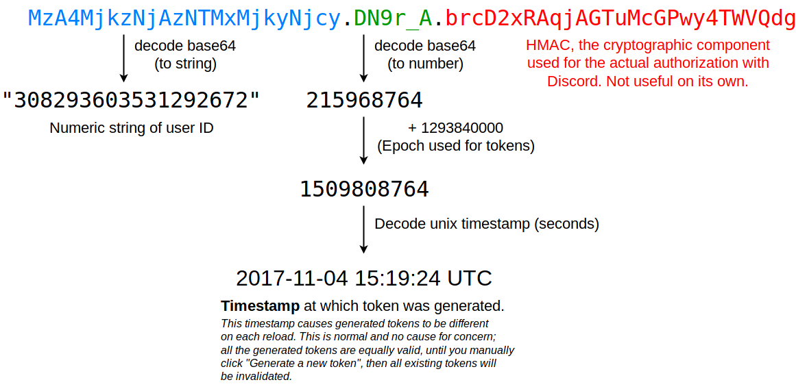

# Discord Tools _(prefixes: discordTools, dt, discord, dtools)_

## extractUserIdFromToken `[token]` (extractUserId, userId, userIdToken, tokenUserId)
Extracts user id from a token using the scheme below.

## weirdMention (longMention)
Generates a long mention.

## maskMessage `[message to display]` `[hidden message]` (mask)
Masks a message using spoiler spam.
